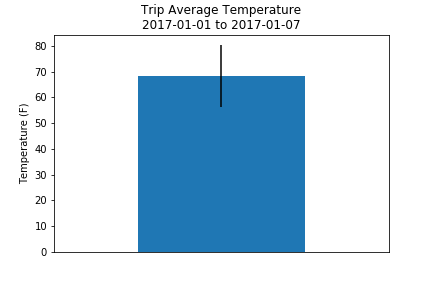
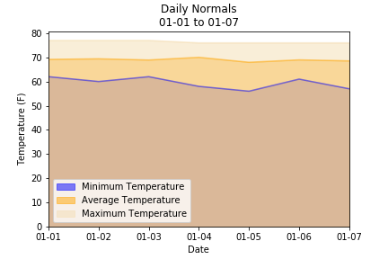

# SurfsUp

## **Objective:**
The objective of this project is to use Python and SQLAlchemy to analyze climate data for Honolulu, Hawaii stored in an SQLite database. The following analyses were completed:

* **Precipitation Analysis:** Analysis of the last 12 months of precipitation data.
* **Station Analysis:** Analysis of the number of temperature observations taken at each station.
* **Temperature Analysis I:** A t-test was conducted to compare the average temperature in June with the average temperature in December.
* **Temperature Analysis II:** The minimum, average, and maximum temperature were calculated for a date range (January 1-7) and presented in a bar chart.
* **Daily Rainfall Average:** The daily rainfall average and daily normals (minimum, average, and maximum temperature) were calculated for a date range (January 1-7) and presented in a table and area plot, respectively.

A Flask API was created based on the first 2 analyses completed. 

## **Tools:**
1. Python -  SQLAlchemy, Flask, Pandas, Numpy
2. HTML

## **Screenshots (Graphs):**

